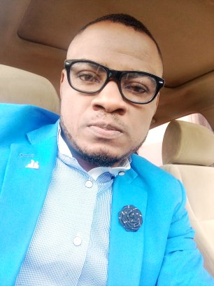

<h2> Hi, I'm Adole Nicholas! </h2>

<p><em>Software Enginner at <a href="https://salemuniversity.edu.ng/">SALEM/SALEM University Nigeria</a></br>Developer Consultant at <a href="https://www.firm.com.ng">Firm Knowledge</a> 
</em></p>

<a href="https://www.facebook.com/don.nicholas.969"></a>

<a href="https://www.linkedin.com/in/nicholas-adole-19943915b/"></a>


[](https://github.com/AdoleaNicholasDebugger)


###  A little more about me...  

```javascript
const nick = {
  pronouns: "he" | "he",
  code: [Javascript, Typescript, HTML, CSS, Python, Java],
  tools: [React js, Redux, React Native, Vanilla PHP, LARAVEL, WordPress, .Net],
  architecture: ["microservices", "event-driven", "design system pattern"],
  
 challenge: "I am doing the #100DaysOfCode challenge focused on react and typescript"
}
```

 <em><b>I love connecting with different people</b> so if you want to say <b>hi, I'll be happy to meet you more!</b> :)</em> 

---
